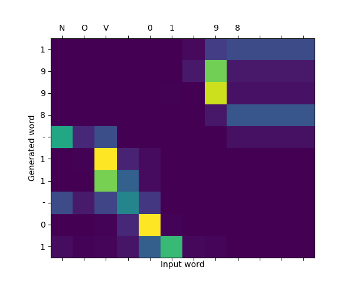
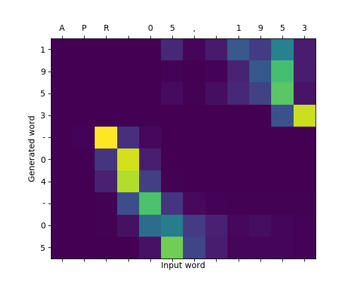
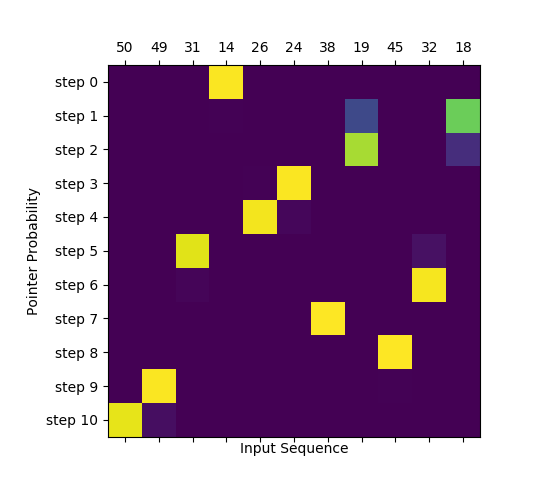

# Sequence 2 Sequence with Attention Mechanisms
This repo contains implementation of:
- Classical Sequence 2 Sequence model without attention. Used in [Date Conversion Problem](#date-conversion-problem)
- Luong's Dot Attention. Used in [Date Conversion Problem](#date-conversion-problem)
- Bahdanau's Attention. Used in [Date Conversion Problem](#date-conversion-problem)
- Pointer Networks a.k.a. Ptr-Net. Used in [Sorting Numbers](#sorting-numbers)

I've tried, as much as possible, to avoid building custom layers in order to ease the readability of the code. Also, note that the code in `/model` folders contains repeated elements (e.g., `Encoder` is the same for all the models). Again, this is done to ease the readability and portability of the code. Each model is contained in a single folder, so you can simply copy it and it should work for you and your own problem.

## Date Conversion Problem
Convert dates in different formats (e.g., `"08/30/21"`, `"080120"`, `"AUG 01, 2020"`) into ISO standard (e.g., `"2021-08-30"`, `"2020-08-01"`) format.

### Problem Stats
- Input vocabulary size: 35
- Input length: 12
- Output vocabulary size: 13
- Output length: 10

### Attention Examples

#### Luong Attention


#### Bahdanau Attention


### Running 
```bash
python date-conversion/main.py <model-name> # One of "seq2seq", "luong" or "bahdanau". If not provided "luong" will be used
```

### Run Unit Tests
```bash
python date-conversion/tests/runner.py
```

## Sorting Numbers
Sorts numbers in an ascending order with Pointer Networks.

### Problem Stats
- Input vocabulary size: 100
- Input length: 10
- Output vocabulary size: 100
- Output length: 10

> Note: Pointer Networks are capable of dealing with inputs of variable length. However, after using `model.compile()` the model is no longer capable of accepting input sequences of different length. I think the only way of achieving this is by not using `model.compile()` and computing the loss and grads manually. This is a `ToDo`...

### Input Example
Sorting numbers between 0 and 9. `10` at the first position is the end-of-sequence EOS.

**Encoder Input**
```bash
tf.Tensor([[10.  2.  9.  3.  0.  5.  1.  8.  6.  4.  7.]], shape=(1, 11), dtype=float32)
```

**Decoder Input**

Decoder is fed with the sorted sequence. `11` at the first position is the start-of-sequence SOS.
```bash
tf.Tensor([[11.  0.  1.  2.  3.  4.  5.  6.  7.  8.  9.]], shape=(1, 11), dtype=float32)
```

**Decoder Expected Output**

One hot encoding where each row represents represents a time-step and the location to which the `pointer` should point. The last row should point to the first position of encoder's input, which is the EOS symbol.

```bash
tf.Tensor(
[[[0 0 0 0 1 0 0 0 0 0 0]
  [0 0 0 0 0 0 1 0 0 0 0]
  [0 1 0 0 0 0 0 0 0 0 0]
  [0 0 0 1 0 0 0 0 0 0 0]
  [0 0 0 0 0 0 0 0 0 1 0]
  [0 0 0 0 0 1 0 0 0 0 0]
  [0 0 0 0 0 0 0 0 1 0 0]
  [0 0 0 0 0 0 0 0 0 0 1]
  [0 0 0 0 0 0 0 1 0 0 0]
  [0 0 1 0 0 0 0 0 0 0 0]
  [1 0 0 0 0 0 0 0 0 0 0]]], shape=(1, 11, 11), dtype=int32)
```

### Attention Examples

#### Pointer Attention


### Running 
```bash
python sorting-numbers/main.py <model-name> # One of "pointer". If not provided "pointer" will be used
```

## Useful Links
A short list of links that I've found useful while I was learning about attention mechanisms:
- Tensorflow.js [data-conversion-attention](https://github.com/tensorflow/tfjs-examples/tree/master/date-conversion-attention) example. I've simply ported the dataset generation script and Luong's attention to Python. All the credit goes to the TF team and the people that built the model.
- [Neural Machine Translation by Jointly Learning to Align and Translate](https://arxiv.org/pdf/1409.0473.pdf)
- [Effective Approaches to Attention-based Neural Machine Translation](https://arxiv.org/abs/1508.04025)
- [Pointer Networks](https://arxiv.org/abs/1506.03134)
- [Neural machine translation with attention](https://www.tensorflow.org/tutorials/text/nmt_with_attention)
- [Attention Mechanism](https://blog.floydhub.com/attention-mechanism/)
- [Attn: Illustrated Attention](https://towardsdatascience.com/attn-illustrated-attention-5ec4ad276ee3)


## Setting the environment and installing the dependencies
Follow Tensorflow's [installation guide](https://www.tensorflow.org/install/pip) to set the environment and get things ready.

> I'm using Python v3.6 and Tensorflow v2.1

## Pytorch Implementation
For Pytorch implementation check [fmstam](https://github.com/fmstam)'s [repo](https://github.com/fmstam/seq2seq_with_deep_attention).

