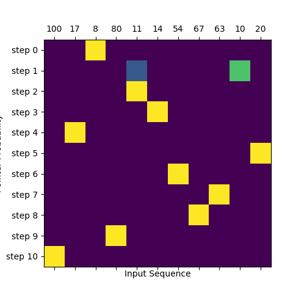

# Sequence 2 Sequence with Attention Mechanisms
This repo contains implementation of:
- Classical Sequence 2 Sequence model without attention. Used in [Date Conversion Problem](#date-conversion-problem)
- Luong's Dot Attention. Used in [Date Conversion Problem](#date-conversion-problem)
- Bahdanau's Attention. Used in [Date Conversion Problem](#date-conversion-problem)
- Pointer Networks a.k.a. Ptr-Net. Used in [Sorting Numbers](#sorting-numbers)
- Pointer Networks with Masking. Used in [Sorting Numbers](#sorting-numbers)

I've tried, as much as possible, to avoid building custom layers in order to ease the readability of the code. Also, note that I've deliberately didn't create generic layers. This means that the code in `/model` folder contains repeated elements (e.g., `Encoder` is almost the same for all the models). However, I think that this way of structuring things will ease the readability of the code and help to understand how the data flows through the layers.

## Date Conversion Problem
Convert dates in different formats (e.g., `"08/30/21"`, `"080120"`, `"AUG 01, 2020"`) into ISO standard (e.g., `"2021-08-30"`, `"2020-08-01"`) format. For more info check the [useful links section](#useful-links).

### Problem Stats
- Input vocabulary size: 35
- Input length: 12
- Output vocabulary size: 13
- Output length: 10


**Input Vocabulary Mappings**
```
Char "\n": Index 0
Char "0": Index 1
Char "1": Index 2
Char "2": Index 3
Char "3": Index 4
Char "4": Index 5
Char "5": Index 6
Char "6": Index 7
Char "7": Index 8
Char "8": Index 9
Char "9": Index 10
Char "/": Index 11
Char "-": Index 12
Char ".": Index 13
Char ",": Index 14
Char " ": Index 15
Char "J": Index 16
Char "A": Index 17
Char "N": Index 18
Char "F": Index 19
Char "E": Index 20
Char "B": Index 21
Char "M": Index 22
Char "R": Index 23
Char "P": Index 24
Char "Y": Index 25
Char "U": Index 26
Char "L": Index 27
Char "G": Index 28
Char "S": Index 29
Char "O": Index 30
Char "C": Index 31
Char "T": Index 32
Char "V": Index 33
Char "D": Index 34
```

**Output Vocabulary Mappings**
```
Char "\n": Index 0
Char "\t": Index 1
Char "0": Index 2
Char "1": Index 3
Char "2": Index 4
Char "3": Index 5
Char "4": Index 6
Char "5": Index 7
Char "6": Index 8
Char "7": Index 9
Char "8": Index 10
Char "9": Index 11
Char "-": Index 12
```

**Possible Input Formats**

Number input formats: 20
```
1 - 01OCT2019
2 - 100119
3 - 10/01/19
4 - 10/01/2019
5 - 10/1/2019
6 - 01-10-2019
7 - 1-10-2019
8 - OCT 01 19
9 - 10/1/19
10 - OCT 01 2019
11 - OCT 01, 19
12 - OCT 01, 2019
13 - 01.10.2019
14 - 1.10.2019
15 - 2019.10.01
16 - 2019.10.1
17 - 20191001
18 - 2019-10-1
19 - 1 OCT 2019
20 - 2019-10-01
```

### Input/Output Example

**Encoder's input example for `01.10.2019`**
```bash
Tensor(
     [[1, 2, 13, 2, 1, 13, 3, 1, 2, 10, 0, 0],], shape=(1, 12))
```

**Decoder's input example for `2019-10-01`**

Decoder is fed with the encoded ISO date a.k.a [teacher forcing](https://machinelearningmastery.com/teacher-forcing-for-recurrent-neural-networks/). The number `1` at the first position is the start-of-sequence (SOS).

```bash
Tensor(
     [[1, 4, 2, 3, 11, 12, 3, 2, 12, 2],], shape=(1, 10))
```

**Decoder's expected output example for `2019-10-01`**

Shape is [10, 13]. 10 is the output length and 13 is the output vocabulary size.

```bash
Tensor(
    [[[0, 0, 0, 0, 1, 0, 0, 0, 0, 0, 0, 0, 0],
      [0, 0, 1, 0, 0, 0, 0, 0, 0, 0, 0, 0, 0],
      [0, 0, 0, 1, 0, 0, 0, 0, 0, 0, 0, 0, 0],
      [0, 0, 0, 0, 0, 0, 0, 0, 0, 0, 0, 1, 0],
      [0, 0, 0, 0, 0, 0, 0, 0, 0, 0, 0, 0, 1],
      [0, 0, 0, 1, 0, 0, 0, 0, 0, 0, 0, 0, 0],
      [0, 0, 1, 0, 0, 0, 0, 0, 0, 0, 0, 0, 0],
      [0, 0, 0, 0, 0, 0, 0, 0, 0, 0, 0, 0, 1],
      [0, 0, 1, 0, 0, 0, 0, 0, 0, 0, 0, 0, 0],
      [0, 0, 0, 1, 0, 0, 0, 0, 0, 0, 0, 0, 0]]], shape=(1, 10, 13))
```

### Attention Plots

#### Luong Attention 

Input: `NOV 01, 98` Output: `1998-11-01`


#### Bahdanau Attention
Input: `APR 04. 1953` Output: `1953-04-04`


### Running 
```bash
python date-conversion/main.py <model-name> <0/1> 
# <model-name> -  One of "seq2seq", "luong" or "bahdanau". If not provided "luong" will be used.
# <0/1> - 1 to plot the attention. If not provided won't plot the attention.
```

### Run Unit Tests
```bash
python date-conversion/tests/runner.py
```

## Sorting Numbers
Sorts numbers in an ascending order with Pointer Networks. For more info check the [useful links section](#useful-links).

### Problem Stats
- Input vocabulary size: 100
- Input length: 10
- Output vocabulary size: 100
- Output length: 10

> Note: Pointer Networks are capable of dealing with inputs of variable length. However, after using `model.compile()` the model is no longer capable of accepting input sequences of different length. I think the only way of achieving this is by not using `model.compile()` and computing the loss and grads manually. This is a `ToDo`...

### Input/Output Example

Sorting numbers between `0` and `9`. The number `10` at the first position is the end-of-sequence (EOS). During the decoding process the last pointer will point to EOS.

**Encoder's Input**
```bash
tf.Tensor([[10.  2.  9.  3.  0.  5.  1.  8.  6.  4.  7.]], shape=(1, 11), dtype=float32)
```

**Decoder's Input**

Decoder is fed with the sorted sequence a.k.a [teacher forcing](https://machinelearningmastery.com/teacher-forcing-for-recurrent-neural-networks/). The number `11` at the first position is the start-of-sequence (SOS).

```bash
tf.Tensor([[11.  0.  1.  2.  3.  4.  5.  6.  7.  8.  9.]], shape=(1, 11), dtype=float32)
```

**Decoder's Expected Output**

One-hot encoding where each row represents represents a time-step and the location to which the `pointer` should point. The last row should point to the first position of encoder's input, which is the EOS symbol.

```bash
tf.Tensor(
[[[0 0 0 0 1 0 0 0 0 0 0]
  [0 0 0 0 0 0 1 0 0 0 0]
  [0 1 0 0 0 0 0 0 0 0 0]
  [0 0 0 1 0 0 0 0 0 0 0]
  [0 0 0 0 0 0 0 0 0 1 0]
  [0 0 0 0 0 1 0 0 0 0 0]
  [0 0 0 0 0 0 0 0 1 0 0]
  [0 0 0 0 0 0 0 0 0 0 1]
  [0 0 0 0 0 0 0 1 0 0 0]
  [0 0 1 0 0 0 0 0 0 0 0]
  [1 0 0 0 0 0 0 0 0 0 0]]], shape=(1, 11, 11), dtype=int32)
```

### Pointers Plots

#### Vanilla Pointer Network
Interesting behavior happens at `step 1` and `step 2` and the numbers `18` and `19`. It shows that at these steps the network is not sure where to point (either to `18` or `19`) because these numbers are close to each other. However, at `step 1` it gives more "attention" to the number `18` so it is selected (correct choice). The downside of vanilla pointer networks can be seen at `step 2`. Number `18` was selected at `step 1` but the network still considers it as a valid option at `step 2`. In this problem in particular, the pointer shouldn't point two times at the same place. This can be solved with masking, i.e., after selecting an element at `step t` it should be masked out in a way that the network ignores it at the next step `step t+1`.

**Vanilla Pointers**


> Note that in this plot number `50` represents the EOS

#### Pointer with Mask

Looking at `step 1` and `step 2` and the numbers `10` and `11` is is possible to see that at `step 1` the networking is unsure between the two numbers but it selects the number `10`. However, contrary to [Pointer Nets without masking](#pointer-attention), at `step 2` the network doesn't even consider the possibility of pointing to the number `10` because it was already selected at `step 1`.

**Pointers with Mask**


> Note that in this plot number `100` represents the EOS

### Running 
```bash
python sorting-numbers/main.py <model-name> # One of "pointer" or "pointer-masking". If not provided "pointer-masking" will be used
```

## Useful Links
A short list of links that I've found useful while I was learning about attention mechanisms:
- Tensorflow.js [data-conversion-attention](https://github.com/tensorflow/tfjs-examples/tree/master/date-conversion-attention) example. I've simply ported the dataset generation script and Luong's attention (slightly refactored). Nevertheless, all the credit goes to the TF team and the people that built the model.
- [Neural Machine Translation by Jointly Learning to Align and Translate](https://arxiv.org/pdf/1409.0473.pdf) - Bahdanau's attention
- [Effective Approaches to Attention-based Neural Machine Translation](https://arxiv.org/abs/1508.04025) - Luong's Attention
- [Pointer Networks](https://arxiv.org/abs/1506.03134)
- [Neural machine translation with attention](https://www.tensorflow.org/tutorials/text/nmt_with_attention)
- [Attention Mechanism](https://blog.floydhub.com/attention-mechanism/)
- [Attn: Illustrated Attention](https://towardsdatascience.com/attn-illustrated-attention-5ec4ad276ee3)


## Setting the environment and installing the dependencies
Follow Tensorflow's [installation guide](https://www.tensorflow.org/install/pip) to set the environment and get things ready.

> I'm using Python v3.6 and Tensorflow v2.1

## Pytorch Implementation
For Pytorch implementation check [fmstam](https://github.com/fmstam)'s [repo](https://github.com/fmstam/seq2seq_with_deep_attention).

