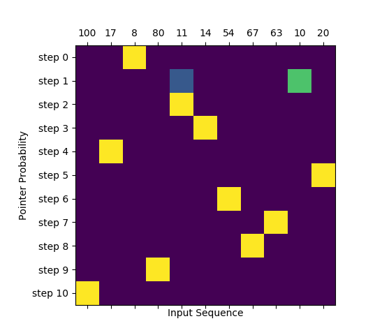

# Sequence 2 Sequence with Attention Mechanisms
This repo contains implementation of:
- Classical Sequence 2 Sequence model without attention. Used in [Date Conversion Problem](#date-conversion-problem)
- Luong's Dot Attention. Used in [Date Conversion Problem](#date-conversion-problem)
- Bahdanau's Attention. Used in [Date Conversion Problem](#date-conversion-problem)
- Pointer Networks a.k.a. Ptr-Net. Used in [Sorting Numbers](#sorting-numbers)
- Pointer Networks with Masking. Used in [Sorting Numbers](#sorting-numbers)

I've tried, as much as possible, to avoid building custom layers in order to ease the readability of the code. Also, note that the code in `/model` folders contains repeated elements (e.g., `Encoder` is the same for all the models). Again, this is done to ease the readability and portability of the code. Each model is contained in a single folder, so (in theory) you can simply copy it and it should work for you and your own problem.

## Date Conversion Problem
Convert dates in different formats (e.g., `"08/30/21"`, `"080120"`, `"AUG 01, 2020"`) into ISO standard (e.g., `"2021-08-30"`, `"2020-08-01"`) format. For more info check the [Useful Links Section](#useful-links).

### Problem Stats
- Input vocabulary size: 35
- Input length: 12
- Output vocabulary size: 13
- Output length: 10


**Input Vocabulary Mappings**
```
Char "\n": Index 0
Char "0": Index 1
Char "1": Index 2
Char "2": Index 3
Char "3": Index 4
Char "4": Index 5
Char "5": Index 6
Char "6": Index 7
Char "7": Index 8
Char "8": Index 9
Char "9": Index 10
Char "/": Index 11
Char "-": Index 12
Char ".": Index 13
Char ",": Index 14
Char " ": Index 15
Char "J": Index 16
Char "A": Index 17
Char "N": Index 18
Char "F": Index 19
Char "E": Index 20
Char "B": Index 21
Char "M": Index 22
Char "R": Index 23
Char "P": Index 24
Char "Y": Index 25
Char "U": Index 26
Char "L": Index 27
Char "G": Index 28
Char "S": Index 29
Char "O": Index 30
Char "C": Index 31
Char "T": Index 32
Char "V": Index 33
Char "D": Index 34
```

**Output Vocabulary Mappings**
```
Char "\n": Index 0
Char "\t": Index 1
Char "0": Index 2
Char "1": Index 3
Char "2": Index 4
Char "3": Index 5
Char "4": Index 6
Char "5": Index 7
Char "6": Index 8
Char "7": Index 9
Char "8": Index 10
Char "9": Index 11
Char "-": Index 12
```

**Possible Input Formats**

Number of supported input formats: 20
```
1 - 01OCT2019
2 - 100119
3 - 10/01/19
4 - 10/01/2019
5 - 10/1/2019
6 - 01-10-2019
7 - 1-10-2019
8 - OCT 01 19
9 - 10/1/19
10 - OCT 01 2019
11 - OCT 01, 19
12 - OCT 01, 2019
13 - 01.10.2019
14 - 1.10.2019
15 - 2019.10.01
16 - 2019.10.1
17 - 20191001
18 - 2019-10-1
19 - 1 OCT 2019
20 - 2019-10-01
```

### Input/Output Example

**Encoder's input example for `01.10.2019`**
```bash
Tensor
     [[1, 2, 13, 2, 1, 13, 3, 1, 2, 10, 0, 0],]
```

**Decoder's input example for `2019-10-01`**
Decoder is fed with the sorted sequence a.k.a [teacher forcing](https://machinelearningmastery.com/teacher-forcing-for-recurrent-neural-networks/). The number `1` at the first position is the start-of-sequence (SOS).

```bash
Tensor
     [[1, 4, 2, 3, 11, 12, 3, 2, 12, 2],]
```

**Decoder's expected output example for `2019-10-01`**
```bash
Tensor
    [[[0, 0, 0, 0, 1, 0, 0, 0, 0, 0, 0, 0, 0],
      [0, 0, 1, 0, 0, 0, 0, 0, 0, 0, 0, 0, 0],
      [0, 0, 0, 1, 0, 0, 0, 0, 0, 0, 0, 0, 0],
      [0, 0, 0, 0, 0, 0, 0, 0, 0, 0, 0, 1, 0],
      [0, 0, 0, 0, 0, 0, 0, 0, 0, 0, 0, 0, 1],
      [0, 0, 0, 1, 0, 0, 0, 0, 0, 0, 0, 0, 0],
      [0, 0, 1, 0, 0, 0, 0, 0, 0, 0, 0, 0, 0],
      [0, 0, 0, 0, 0, 0, 0, 0, 0, 0, 0, 0, 1],
      [0, 0, 1, 0, 0, 0, 0, 0, 0, 0, 0, 0, 0],
      [0, 0, 0, 1, 0, 0, 0, 0, 0, 0, 0, 0, 0]]]
```

### Attention Examples

#### Luong Attention


#### Bahdanau Attention


### Running 
```bash
python date-conversion/main.py <model-name> # One of "seq2seq", "luong" or "bahdanau". If not provided "luong" will be used
```

### Run Unit Tests
```bash
python date-conversion/tests/runner.py
```

## Sorting Numbers
Sorts numbers in an ascending order with Pointer Networks. For more info check the [Useful Links Section](#useful-links).

### Problem Stats
- Input vocabulary size: 100
- Input length: 10
- Output vocabulary size: 100
- Output length: 10

> Note: Pointer Networks are capable of dealing with inputs of variable length. However, after using `model.compile()` the model is no longer capable of accepting input sequences of different length. I think the only way of achieving this is by not using `model.compile()` and computing the loss and grads manually. This is a `ToDo`...

### Input/Output Example

Sorting numbers between `0` and `9`. The number `10` at the first position is the end-of-sequence (EOS).

**Encoder Input**
```bash
tf.Tensor([[10.  2.  9.  3.  0.  5.  1.  8.  6.  4.  7.]], shape=(1, 11), dtype=float32)
```

**Decoder Input**

Decoder is fed with the sorted sequence a.k.a [teacher forcing](https://machinelearningmastery.com/teacher-forcing-for-recurrent-neural-networks/). The number `11` at the first position is the start-of-sequence (SOS).

```bash
tf.Tensor([[11.  0.  1.  2.  3.  4.  5.  6.  7.  8.  9.]], shape=(1, 11), dtype=float32)
```

**Decoder Expected Output**

One hot encoding where each row represents represents a time-step and the location to which the `pointer` should point. The last row should point to the first position of encoder's input, which is the EOS symbol.

```bash
tf.Tensor(
[[[0 0 0 0 1 0 0 0 0 0 0]
  [0 0 0 0 0 0 1 0 0 0 0]
  [0 1 0 0 0 0 0 0 0 0 0]
  [0 0 0 1 0 0 0 0 0 0 0]
  [0 0 0 0 0 0 0 0 0 1 0]
  [0 0 0 0 0 1 0 0 0 0 0]
  [0 0 0 0 0 0 0 0 1 0 0]
  [0 0 0 0 0 0 0 0 0 0 1]
  [0 0 0 0 0 0 0 1 0 0 0]
  [0 0 1 0 0 0 0 0 0 0 0]
  [1 0 0 0 0 0 0 0 0 0 0]]], shape=(1, 11, 11), dtype=int32)
```

### Attention Examples

#### Pointer Attention
Interesting behavior happens at `step 1` and `step 2` and the numbers `18` and `19`. It shows that at these steps the network is not sure where to point (either to `18` or `19`) because these numbers are close to each other. However, at `step 1` it gives more "attention" to the number `18` so it is selected (correct choice). The downside of vanilla pointer networks can be seen at `step 2`. Number `18` was selected at `step 1` but the network still considers it as a valid option at `step 2`. In this problem in particular, the pointer shouldn't point two times at the same place. This can be solved with masking, i.e., after selecting an element at `step t` it should be masked out in a way that the network ignores it at the next step `step t+1`.


#### Pointer Attention with Mask

Looking closely at `step 1` and `step 2` and the numbers `10` and `11` we can see that at `step 1` the networking is unsure between the two numbers but it selects the number `10`. However, contrary to [Pointer Nets without masking](#pointer-attention), at `step 2` the network doesn't even consider the possibility of pointing to the number `10` because it was already selected at `step 1`.



### Running 
```bash
python sorting-numbers/main.py <model-name> # One of "pointer" or "pointer-masking". If not provided "pointer-masking" will be used
```

## Useful Links
A short list of links that I've found useful while I was learning about attention mechanisms:
- Tensorflow.js [data-conversion-attention](https://github.com/tensorflow/tfjs-examples/tree/master/date-conversion-attention) example. I've simply ported the dataset generation script and Luong's attention (slightly refactored). Nevertheless, All the credit goes to the TF team and the people that built the model.
- [Neural Machine Translation by Jointly Learning to Align and Translate](https://arxiv.org/pdf/1409.0473.pdf)
- [Effective Approaches to Attention-based Neural Machine Translation](https://arxiv.org/abs/1508.04025)
- [Pointer Networks](https://arxiv.org/abs/1506.03134)
- [Neural machine translation with attention](https://www.tensorflow.org/tutorials/text/nmt_with_attention)
- [Attention Mechanism](https://blog.floydhub.com/attention-mechanism/)
- [Attn: Illustrated Attention](https://towardsdatascience.com/attn-illustrated-attention-5ec4ad276ee3)


## Setting the environment and installing the dependencies
Follow Tensorflow's [installation guide](https://www.tensorflow.org/install/pip) to set the environment and get things ready.

> I'm using Python v3.6 and Tensorflow v2.1

## Pytorch Implementation
For Pytorch implementation check [fmstam](https://github.com/fmstam)'s [repo](https://github.com/fmstam/seq2seq_with_deep_attention).

